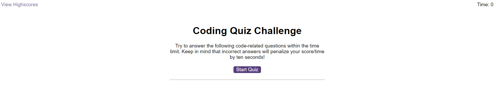
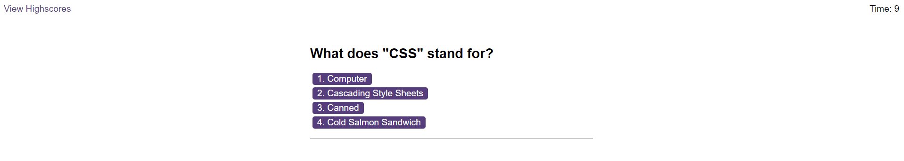
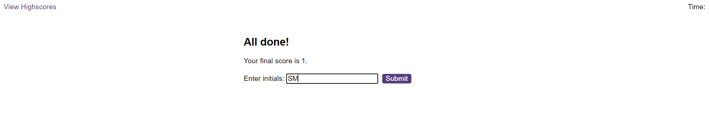

# Code-Quiz

## Project Description

The following project includes a coding quiz that allows a user to answer a series of questions within a specific time limit. Upon answering the question there is both text and audible feedback to the user. However, if the user gets the question wrong, they are progressed to the next question and 10 seconds is removed from the time limit, if the user answers correctly, their overall score is incremented by 1 and they are able to progress to the next question. At the end of the quiz, the user is able to see their score and save it using their initials. This score is then saved to the highscores table, which is saved to the users local storage and can be retrieved later.

### Home Page

### Question Screen

### Scores Screen

### Highscores table

### Completed Tasks:

* A start button that when clicked a timer starts and the first question appears.
 
  * Questions contain buttons for each answer.
  * When an answer is clicked, the next question appears and the score increments accordingly.
  * If the answer clicked was incorrect then 10 seconds is subtracted from the clock.

* The quiz ends when all questions are answered or the timer reaches 0.

  * When the game ends, the users score is displayed and the user has the ability to save their initials and score to local storage.

## Installation

This single static website can be deployed either locally or to a webserver. With the included "index.html" file containing the main code for the website, and the accompanying "style.css" stylesheet and "logic.js", "questions.js" and "scores.js" script files. Alternatively, the website can be found on the GitHub Pages link below.

### logic.js

Contains the main logic for the quiz. Including:
* Setting up the question canvas and the end screen canvas.
* Creating answer buttons.
* Initialising the timer logic.
* Tracking user responses.

### questions.js

* Stores questions, including answers and logic for retrieving correct answer.
* Contains functions for:
    * Retrieving questions
    * Checking answers
    * Removing duplicate questions

### scores.js

Contains functionality for:
* Setting and saving the users current score to local storage.
* Retrieving any current scores saved in local storage to be displayed on the highscore page.
* Ensuring that score objects are clear before writing to them.
* Displaying scores on screen.

### Notes

Designed primarily for a desktop experience, the site can be accessed on small screen sizes, with a minimum screensize of 600px horizontally. Please keep this in mind when accessing the site on your device.

### GitHub Pages:

[GitHub Pages](https://sunielmudhar.github.io/Code-Quiz/index.html)